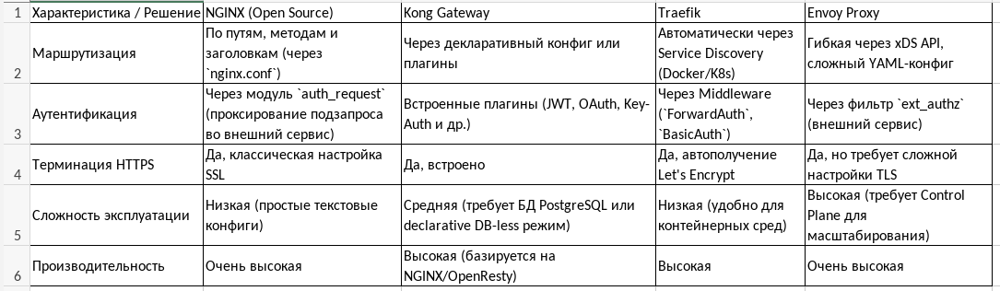
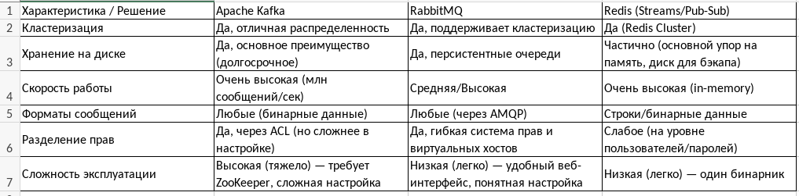
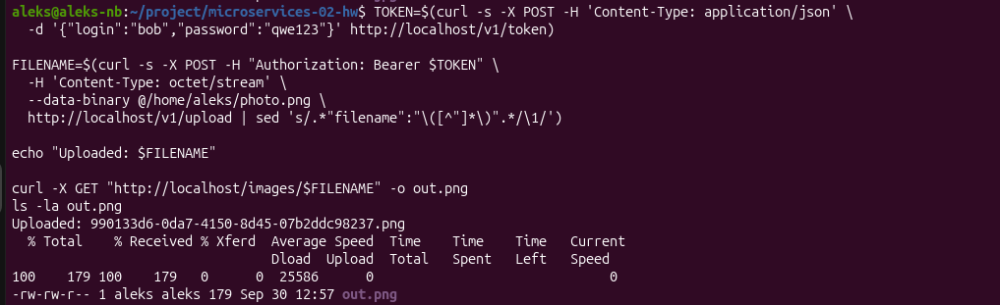

# Домашнее задание к занятию «Микросервисы: принципы»

## Задача 1: API Gateway

Предложите решение для обеспечения реализации API Gateway. Составьте сравнительную таблицу возможностей различных программных решений. На основе таблицы сделайте выбор решения.

Решение должно соответствовать следующим требованиям:

 . маршрутизация запросов к нужному сервису на основе конфигурации,
 . возможность проверки аутентификационной информации в запросах,
 . обеспечение терминации HTTPS.

Обоснуйте свой выбор.

**Решение 1**

Выбор решения NGINX (Open Source)

Обоснование выбора

1. Маршрутизация: NGINX предоставляет предсказуемый и надежный механизм маршрутизации на основе URI (location), что полностью покрывает базовые потребности API Gateway.
2. Аутентификация: Наличие модуля auth_request позволяет реализовать проверку токенов через подзапрос к отдельному микросервису (например, к сервису security), не усложняя конфигурацию самого шлюза.
3. Терминация HTTPS: NGINX отлично справляется с SSL-терминацией, снимая нагрузку по шифрованию с бэкенд-сервисов.
3. Эксплуатация: В отличие от Kong, NGINX не требует дополнительной базы данных для хранения конфигурации, работает быстрее и потребляет меньше ресурсов. Конфигурация пишется в виде понятных текстовых файлов, что упрощает версионирование и деплой (IaC).

## Задача 2: Брокер сообщений

Составьте таблицу возможностей различных брокеров сообщений. На основе таблицы сделайте обоснованный выбор решения.

Решение должно соответствовать следующим требованиям:

. поддержка кластеризации для обеспечения надёжности,
. хранение сообщений на диске в процессе доставки,
. высокая скорость работы,
. поддержка различных форматов сообщений,
. разделение прав доступа к различным потокам сообщений,
. простота эксплуатации.

Обоснуйте свой выбор.

**Решение 2**

Выбор решения RabbitMQ

Обоснование выбора

1. Кластеризация: Поддерживает кластеризацию для обеспечения надёжности.
2. Хранение на диске: Есть поддержка персистентных очередей — сообщения сохраняются на диске.
3. Скорость работы: Обеспечивает достаточную производительность для большинства бизнес-задач.
4. Форматы сообщений: Работает с любыми форматами данных через протокол AMQP.
5. Разделение прав: Встроенная гибкая система управления правами доступа к очередям (в отличие от Redis, где это реализовано слабее).
6. Простота эксплуатации: Эксплуатировать легко. В отличие от Kafka, не требует сложных дополнительных компонентов вроде ZooKeeper и имеет удобный интерфейс для мониторинга.

## Задача 3: API Gateway * (необязательная)

[docker-compose](docker-compose.yaml)

[nginx.conf](gateway/nginx.conf)